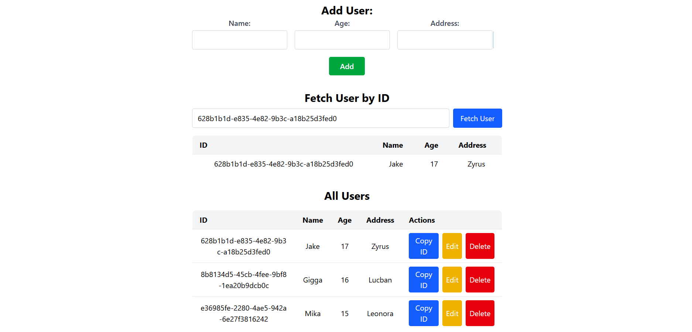
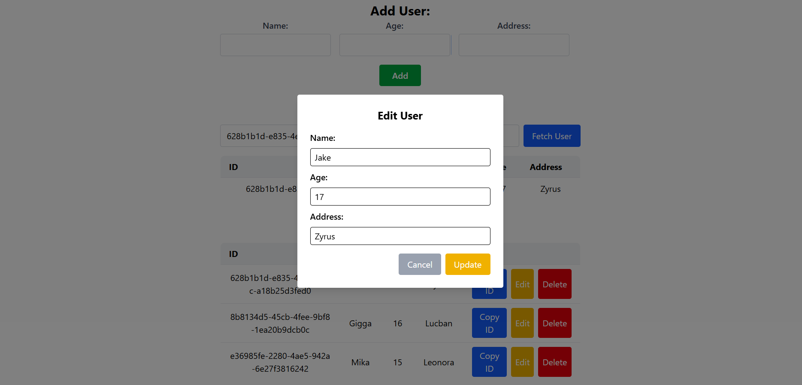

# React + Django Restframework + Serialization CRUD
A simple CRUD for full-stack with serialization

## Tech Stack used:
- **Frontend:** Vite React + Tailwind CSS
- **Backend:** Django + ORM + REST Framework + Serialization
- **Database:** SQLite

## Preview



## Setup
1. Clone this repository via `git clone https://github.com/khianvictorycalderon/React-DRF-Serialization-CRUD.git`
2. Then create 2 separate terminal for both `frontend` and `backend` folder.

---

## Backend Setup (Inside the backend folder)
1. Generate a safe key using this command in your python interpreter or cmd:
    ```python
    from django.core.management.utils import get_random_secret_key
    print(get_random_secret_key())
    ```
2. Create an `.env` file that contains (paste the generated key in `DJANGO_SECRET_KEY`):
    ```env
    DJANGO_ENV=development
    DJANGO_SECRET_KEY=your-key-here
    DEBUG=True
    ```
3. Go to `backend/settings.py` and look for the `HOSTS` part and update it depending on your frontend.
    Change the allowed and trusted credentials depending on where you want your project to be tested.
4. Run the following command for database migration:
    - `python manage.py makemigrations` or `py manage.py makemigrations`
    - `python manage.py migrate` or `py manage.py migrate`
5. To run the server, run `py manage.py runserver` or `python manage.py runserver`
    NOTE: If you encounter `Error: You don't have permission to access that port.`, just use a different port, for example:
    - `py manage.py runserver 8001`
    - `python manage.py runserver 8002`
    8001 and 8002 are the port.
6. To create another app, just run `python manage.py startapp <app-name>` or `py manage.py startapp <app-name>`, example: `py manage.py startapp myapp`

## Backend Admin
1. To access the database using admin panel type in the url: "/admin"
2. Run `py manage.py createsuperuser` then enter the email, username, and password you want to use
3. You can edit your database now by logging in your account

---

## Frontend Setup (Inside the frontend folder)
1. Run `npm install`
2. Create an `.env` file that contains:
  ```env
  VITE_API_URL=your-api-here
  ```
  Then change the `API_URL` depending on where you run the backend.
3. Run `npm run dev`
4. Test all the CRUD features!

---

## Frontend Prerequisites:
Install the following first if you haven't installed it yet:
- NodeJS
- `npm install tailwindcss @tailwindcss/vite`
- `npm install axios`

## Backend Prerequisites:
Install the following first (globally) if you haven't installed it yet:
- `pip install django`
- `pip install djangorestframework`
- `pip install django-cors-headers`